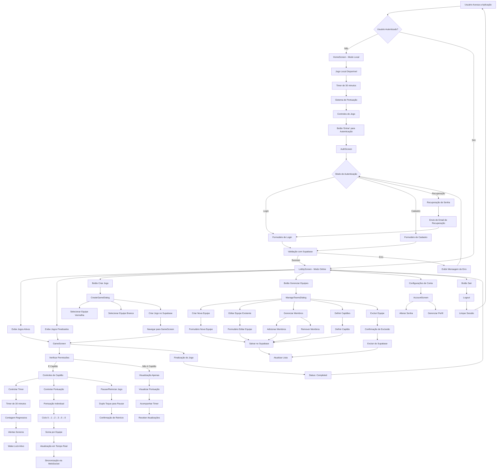
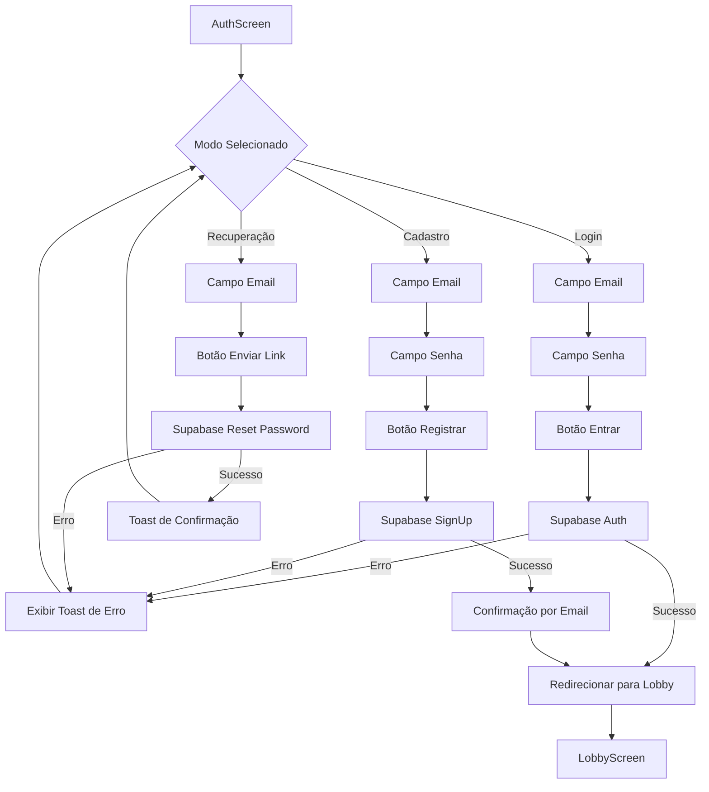
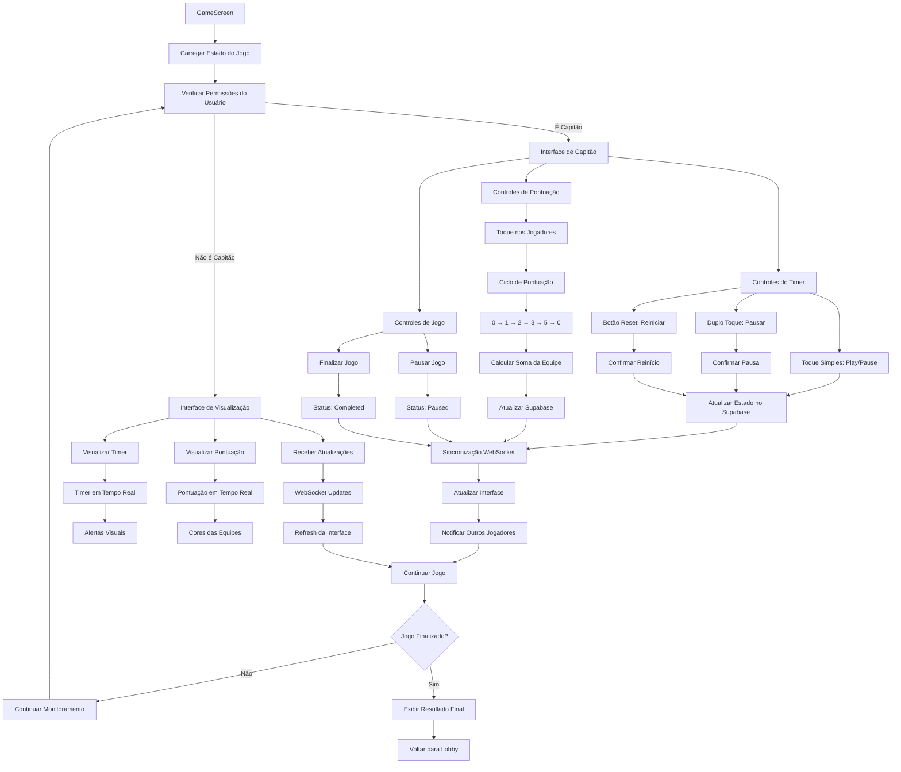
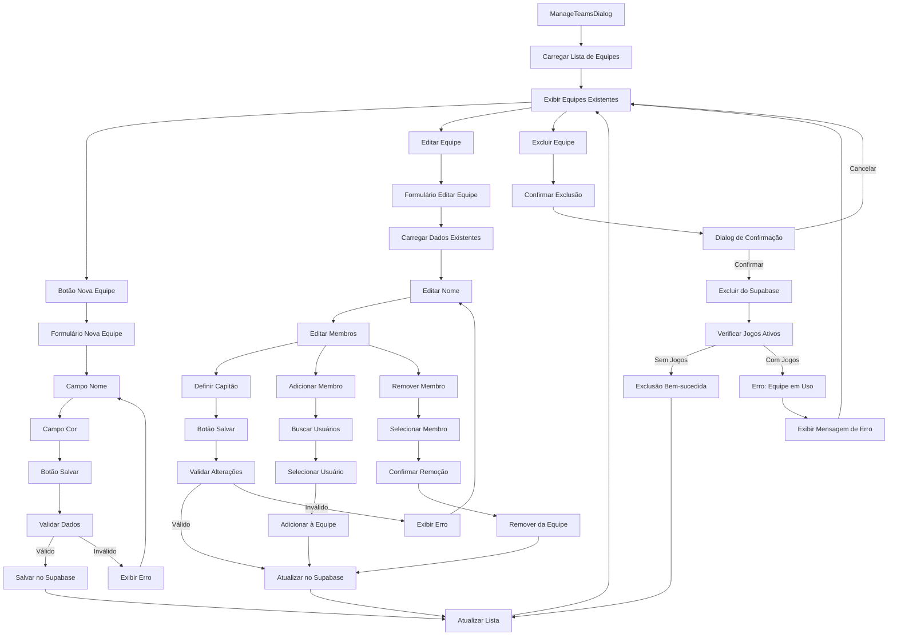
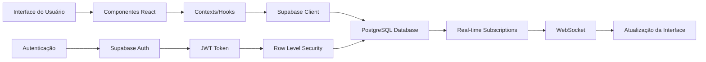

# Fluxograma da Aplicação TimerGateBall Web

Este documento apresenta o fluxograma completo do funcionamento da aplicação TimerGateBall Web, uma plataforma moderna para gerenciamento de partidas de Gateball.

## Visão Geral da Aplicação

A aplicação TimerGateBall Web é uma solução completa para organização e acompanhamento de partidas de Gateball, desenvolvida com React/Vite e Supabase como backend.

## Fluxograma Principal

## Fluxograma de Autenticação

## Fluxograma do Jogo

## Fluxograma de Gerenciamento de Equipes

## Componentes Principais

### 1. **AuthProvider (Context)**
- Gerencia estado de autenticação
- Integração com Supabase Auth
- Funções: login, cadastro, logout, recuperação de senha

### 2. **GameProvider (Context)**
- Gerencia estado do jogo atual
- Controla ID do jogo e permissões de capitão

### 3. **Timer Component**
- Cronômetro regressivo de 30 minutos
- Alertas visuais e sonoros
- Controles de play/pause/reset

### 4. **PlayerScore Component**
- Pontuação individual dos jogadores
- Ciclo: 0 → 1 → 2 → 3 → 5 → 0
- Cores diferenciadas por equipe

### 5. **TeamScore Component**
- Soma automática da pontuação da equipe
- Atualização em tempo real

### 6. **GameScreen Component**
- Interface principal do jogo
- Controles de capitão vs visualização
- Sincronização via WebSocket

### 7. **LobbyScreen Component**
- Hub principal para usuários autenticados
- Lista de jogos ativos e finalizados
- Acesso a todas as funcionalidades

## Tecnologias Utilizadas

- **Frontend**: React 18, Vite 4, Tailwind CSS
- **UI Components**: Radix UI primitives
- **Backend**: Supabase (PostgreSQL, Auth, Real-time)
- **Animations**: Framer Motion
- **Icons**: Lucide React
- **Routing**: React Router DOM

## Recursos Especiais

### 1. **Sistema de Tempo Real**
- WebSocket para sincronização instantânea
- Atualizações automáticas de pontuação
- Notificações de mudanças de estado

### 2. **Controle de Acesso**
- Capitães têm controles completos
- Outros jogadores têm acesso apenas para visualização
- Autenticação obrigatória para jogos online

### 3. **Wake Lock**
- Mantém a tela ligada durante o jogo
- Evita interrupções durante partidas

### 4. **Áudio**
- Alertas sonoros para eventos importantes
- Inicialização sob demanda para compatibilidade

### 5. **Responsividade**
- Interface adaptável para diferentes dispositivos
- Otimizada para uso em tablets e smartphones

## Fluxo de Dados

Este fluxograma documenta completamente o funcionamento atual da aplicação TimerGateBall Web, desde a autenticação até o gerenciamento de jogos e equipes.