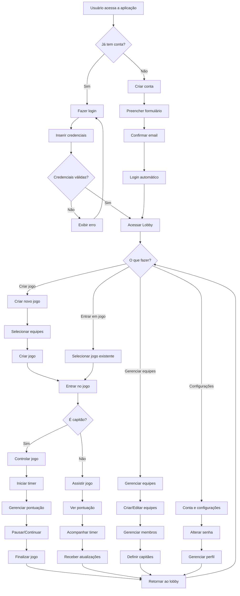
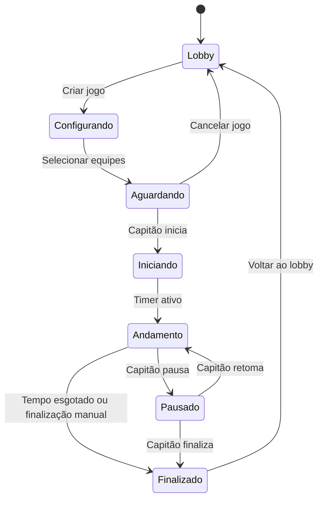
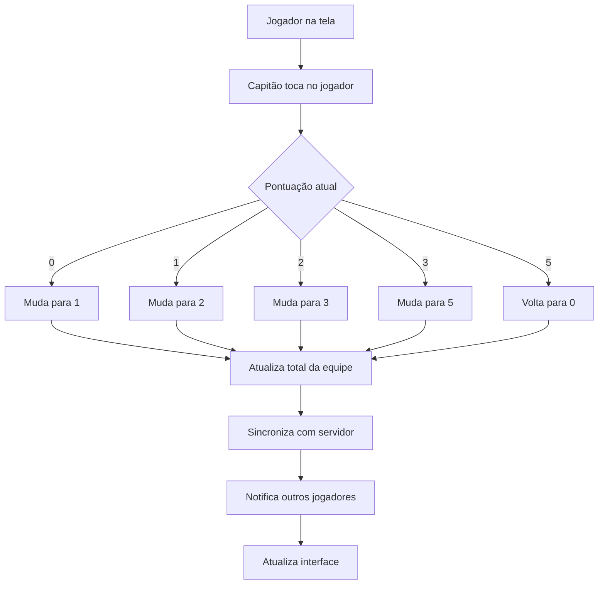
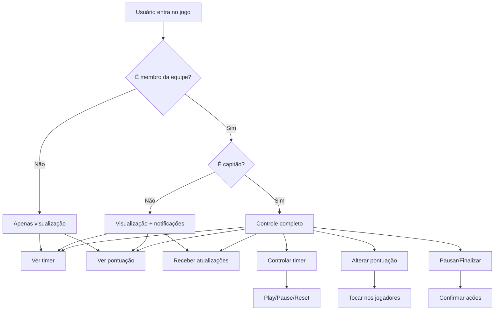
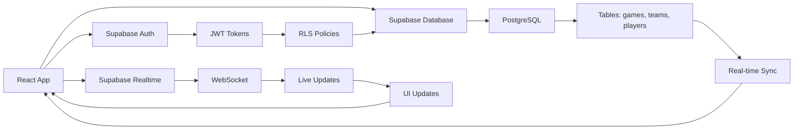

# Fluxograma Simplificado - Jornadas do Usuário

Este documento apresenta uma visão simplificada das principais jornadas do usuário na aplicação TimerGateBall Web.

## Jornada Principal do Usuário

## Estados do Jogo

## Fluxo de Pontuação

## Permissões e Roles

## Tecnologias e Integração

## Resumo das Funcionalidades

### 🔐 **Autenticação**
- Login/Cadastro com email e senha
- Recuperação de senha
- Sessão persistente

### 🎮 **Gestão de Jogos**
- Criar novos jogos
- Listar jogos ativos e finalizados
- Entrar em jogos existentes
- Excluir jogos não utilizados

### ⏱️ **Timer de Jogo**
- Cronômetro de 30 minutos
- Controles de play/pause/reset
- Alertas visuais e sonoros
- Duplo toque para pausar

### 🏆 **Sistema de Pontuação**
- Pontuação individual (0→1→2→3→5→0)
- Soma automática por equipe
- Atualização em tempo real
- Cores diferenciadas por equipe

### 👥 **Gerenciamento de Equipes**
- Criar e editar equipes
- Adicionar/remover membros
- Definir capitães
- Controle de permissões

### 🔄 **Sincronização**
- Atualizações em tempo real
- WebSocket para comunicação
- Notificações automáticas
- Estado consistente entre usuários

### 📱 **Interface**
- Design responsivo
- Animações suaves
- Feedback visual
- Wake lock durante jogos